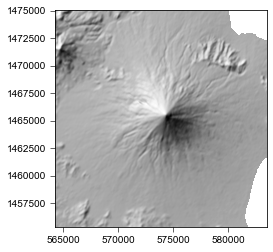
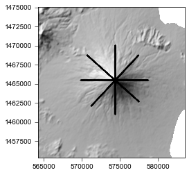
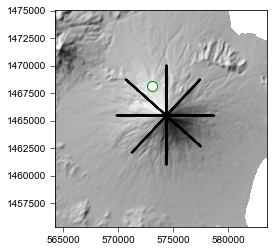
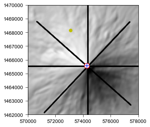
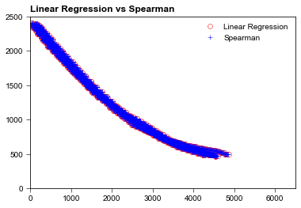

# ConeCone
### Geometrical approach to reconstruct Volcanoes

_The reconstruction of volcanic landforms is an effective way to assess the construction history and growth rates of volcanic structures and is a useful tool to estimate erosion rates. We propose a simple geometrical approach to reveal the location of the long-term eruption centers and the general shape of eroded volcanoes within the altitudinal range of the input data. This DEM-based approach consists of finding the radial topographic profile of an eroded volcanic landform from its remaining surfaces, by coupling two independent and simple mathematical methods (linear regression and Spearman rank correlation)._ 

Gayer, E., Michon, L., & Villeneuve, N. (2021). Volcanic island multi-stage construction inferred from a simple geometrical approach: Example of Réunion Island. Geomorphology, 392, 107900. https://doi.org/10.1016/J.GEOMORPH.2021.107900


# Tutorial - Case Study : MAYON volcano

```python
import FnConeCone as fcc
import rasterio as rs
import matplotlib.pyplot as plt
import numpy as np
from matplotlib.colors import LightSource
ls = LightSource(azdeg=315, altdeg=45)
```

# Case Study : MAYON volcano

To illustrate the ability of ConeCone to reconstruct both the center and the general shape of a volcano, here we use the Mayon volcano

## -1- Load Mayon DEM (UTM)

(Rasterio is not mandatoty to use ConeCone, it is just easy to work with raster data) 


```python
## DEM MAYON
Mayon=rs.open('Mayon_MNT_UTM_51N.tif')
Mayon_z=Mayon.read(1)
extent_Mayon=[Mayon.bounds[0],Mayon.bounds[2],Mayon.bounds[1],Mayon.bounds[3]]
Mayon_z[Mayon_z<0]=np.nan
```


```python
plt.figure()
plt.imshow(ls.hillshade(Mayon_z, vert_exag=0.01), cmap='gray', extent=extent_Mayon)
plt.show()
```


    

    


## -2-  "Control Points"

To estimate the center and the general shape of a volano we need Control Points. Control points are located on the remnants of the colcano we seek to reconstruct. Here, as an example we use altitudinal profiles around the summit.

For each control point we use X,Y coordinates (in UTM for ConeCone) and Z (elevation in m)


```python
## CONTROL POINTS
xc,yc,zc=np.loadtxt('XYZ_ControlPoint_MayonUTM_51N.csv',delimiter=',', unpack=True, skiprows=1)
```


```python
plt.figure()
plt.imshow(ls.hillshade(Mayon_z, vert_exag=0.01), cmap='gray', extent=extent_Mayon)
plt.plot(xc,yc,'ok', ms=0.5)
plt.show()
```


    

    


## -3- "Initial Guess"

ConeCone looks, all over the DEM, for the Best Center of the volcano. 

- First it calculates the distance between all the Control Points and the potential Best Center
- Second it tests the Spearman Correaltion and the Linear Regression between the distance it just calculated and the elevation of each Control Points.
- Finally, 2 Best Centers are gicen, one with the best Spearmann coeficient, the other with the best Linear Regression Coefficient 

HOWEVER, using __fmin__ from __scipy.optimize__ ConeCone needs an initial guess. For this example the initial guess is located at the bottom of the volcano


```python
initialguessX=573070
initialguessY=1468161

plt.figure()
plt.imshow(ls.hillshade(Mayon_z, vert_exag=0.01), cmap='gray', extent=extent_Mayon)
plt.plot(xc,yc,'ok', ms=0.5)
plt.plot(initialguessX,initialguessY, marker='o', c='w', mec='g', ms=10)
plt.show()
```


    

    


## -4- ConeCone in action


```python
Center_results=fcc.conecone_CenterProfile(xc,yc,zc,initialguessX,initialguessY)
print(Center_results)
```

    {'BestCenter_LR_xy': array([ 574259.07526354, 1465566.61382156]), 'RadiusModel_controlPoint_LR': array([1.90276913e+00, 8.20021624e+00, 1.70793735e+01, ...,
           4.84369298e+03, 4.85258296e+03, 4.86154700e+03]), 'Elevation_controlPoint_LR': array([2380.46094, 2380.46094, 2380.46094, ...,  495.80801,  495.80801,
            495.80801]), 'BestCenter_Sp_xy': array([ 574256.01430032, 1465575.41677145]), 'RadiusModel_controlPoint_Sp': array([2.87091402e+00, 9.28957320e+00, 9.44806701e+00, ...,
           4.83554865e+03, 4.84443865e+03, 4.85340265e+03]), 'Elevation_controlPoint_Sp': array([2380.46094, 2380.46094, 2380.46094, ...,  495.80801,  495.80801,
            495.80801])}


## -5- Location of the Center of the Volano

- Center given by Linear Regression is shown as a Red circle
- Center given by Spearman's Correlation is shown as a Blue cross


```python
plt.figure()
plt.imshow(ls.hillshade(Mayon_z, vert_exag=0.01), cmap='gray', extent=extent_Mayon)
plt.plot(xc,yc,'ok', ms=1)
plt.plot(initialguessX,initialguessY, 'oy')
plt.plot(Center_results['BestCenter_LR_xy'][0],Center_results['BestCenter_LR_xy'][1], marker='o', c='w', mec='r', ms=10)
plt.plot(Center_results['BestCenter_Sp_xy'][0],Center_results['BestCenter_Sp_xy'][1], '+b', ms=10)
plt.xlim(570000,578000)
plt.ylim(1462000,1470000)
plt.show()
```


    

    


## -6- General Shape of the volcano


```python
plt.figure()
plt.title('Linear Regression vs Spearman ')
plt.plot(Center_results['RadiusModel_controlPoint_LR'], Center_results['Elevation_controlPoint_LR'],'ow', mec='r', mew=0.5, label='Linear Regression')
plt.plot(Center_results['RadiusModel_controlPoint_Sp'], Center_results['Elevation_controlPoint_Sp'] ,'+', mec='b', mew=0.5,label='Spearman')
plt.legend(frameon=False)
plt.xlim(0,6500)
plt.ylim(0,2500)
plt.show()
```


    

    

